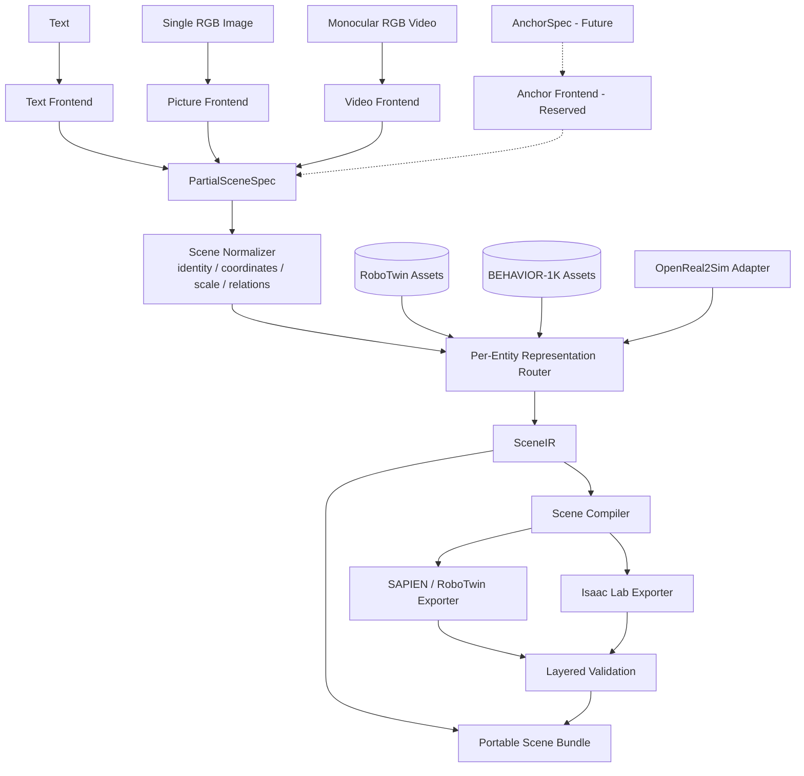
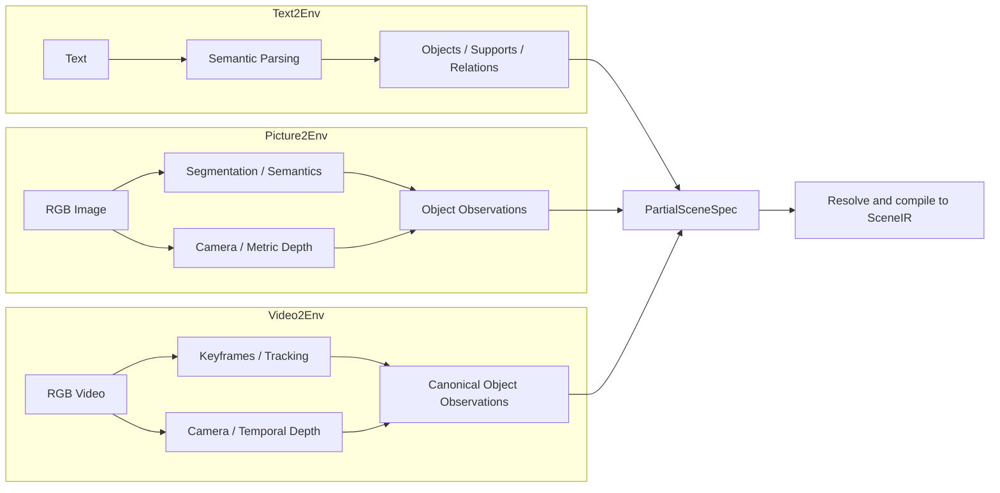
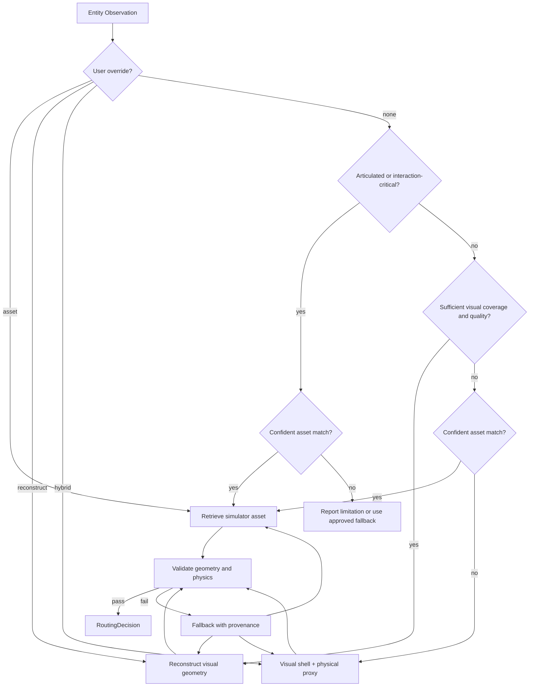

# X2Env：统一的多模态仿真环境生成框架

> **项目状态：架构设计阶段。** 本文描述 X2Env 的目标、接口与实施路线，不表示文中模块已经实现，也不构成对性能、兼容性或重建质量的承诺。

X2Env 计划将文本、单张 RGB 图片或单目 RGB 视频转换为结构化、可验证、可导出到不同仿真器的三维环境。它不把某一种感知或生成方法包装成唯一入口，而是把不同输入先转换为统一场景表示，再针对每个物体决定使用现有仿真资产、视觉重建几何，还是二者结合的混合表示。

首批目标后端为 **SAPIEN/RoboTwin** 与 **Isaac Lab**。场景可以包含碰撞、质量、刚体属性以及门和抽屉等关节，但 X2Env 本身不生成机器人、操作任务、策略、训练数据或成功条件。

---

## 1. 为什么需要 X2Env

Text2Env、Picture2Env 和 Video2Env 面临的输入不同，但在进入仿真器前都需要回答同一组问题：

- 场景里有哪些实体，它们的身份、类别和功能是什么？
- 实体之间有哪些支撑、包含和空间关系？
- 每个实体的尺度、位姿、几何、碰撞和物理属性是什么？
- 某个物体应该匹配资产库，还是根据观测重建？
- 同一个场景如何稳定地导出到不同仿真后端？
- 如何记录模型、资产、观测和决策来源，使结果可以检查和复现？

X2Env 的核心不是“把所有东西都重建”，而是一个统一的**环境编译框架**：模态前端负责理解输入，场景中间表示负责消除模态差异，逐物体路由器负责选择表示方式，后端编译器负责生成仿真器可加载的场景。

### 1.1 首版范围

| 能力 | 首版规划 | 说明 |
| --- | --- | --- |
| Text2Env | 端到端目标 | 文本生成明确对象及必要支撑面 |
| Picture2Env | 端到端目标 | 单张 RGB 图片，相机内参可选 |
| Video2Env | 端到端目标 | 单目 RGB 视频，相机内参可选 |
| Anchor2Env | 仅预留接口 | 暂不冻结锚点语义和约束策略 |
| SAPIEN/RoboTwin | 正式目标后端 | 用于场景加载与物理验收 |
| Isaac Lab | 正式目标后端 | 与 SAPIEN 共享同一份 `SceneIR` |
| 室外环境 | 不在首版范围 | 首版覆盖桌面和单房间室内环境 |
| 多模态联合输入 | 不在首版范围 | 每次生成只接受一种主输入 |
| 动态行为生成 | 不在首版范围 | 视频轨迹作为证据，不作为控制策略 |

“端到端目标”表示路线图希望达到的能力，并不表示当前仓库已经具备该能力。

### 1.2 明确不负责的内容

X2Env 的输出边界止于可交互环境。以下内容不属于本框架：

- 机器人本体选择、生成或标定；
- 操作任务、奖励函数、成功条件与重置逻辑；
- 运动规划、策略推理、强化学习与模仿学习；
- 轨迹采集、训练数据生成和基准评测流水线；
- 将视频中的观测运动反演为控制器或物理行为模型。

---

## 2. 总体架构



框架分为五层：

1. **模态前端**：从文本、图片或视频中提取可验证的局部场景事实。
2. **规范化层**：统一对象身份、单位、坐标、尺度、空间关系和置信度。
3. **表示路由层**：逐物体选择 `asset`、`reconstruct` 或 `hybrid`。
4. **场景编译层**：补齐碰撞、物理和关节信息，形成后端无关的 `SceneIR`。
5. **后端与验收层**：导出 SAPIEN/Isaac Lab，并分别检查语义、几何和物理结果。

每次运行只能选择一个主输入模态。首版不处理“图片 + 文本补充”“视频 + 锚点覆盖”等联合输入，因此也暂不定义不同模态发生冲突时的优先级。

---

## 3. 三条输入链路



### 3.1 Text2Env

Text2Env 将自然语言解析为对象、属性、数量、必要支撑面和空间关系。在线 VLM/API 是首选语义解析方式，但模型调用必须位于可替换的 Provider 接口之后。

建议流程：

1. 提取实体类别、数量、颜色、材质、可动性及显式关系。
2. 为无法成立的悬空对象补充**必要支撑面**，例如桌面或地面。
3. 不自动生成文本未要求的完整房间、墙面或装饰性背景。
4. 在 RoboTwin 和 BEHAVIOR-1K 中搜索符合语义与物理要求的资产。
5. 对缺少合适资产的实体，进入参数化建模、视觉无关的几何生成或明确失败流程。
6. 通过布局求解满足支撑、包含、相对位置、无穿透和工作空间约束。

Text2Env 不应把语言模型直接输出当作最终仿真场景。语言模型提供的是待验证的结构化意图，尺度、碰撞和稳定性仍由场景编译与验收层负责。

### 3.2 Picture2Env

Picture2Env 接受一张 RGB 图片；相机内参可以由用户提供，也可以由视觉模型估计。其输出不是一整块不可编辑的场景网格，而是一组具有身份、几何、关系和来源的场景实体。

建议流程：

1. 检测并分割地面、墙面、支撑面和独立物体。
2. 识别对象类别、可动性线索、空间关系和资产候选。
3. 估计相机内参、相机坐标约定和度量深度。
4. 由掩码、深度和相机参数构建对象级点云及静态结构几何。
5. 为每个对象独立执行资产/重建/混合路由。
6. 将二维观测、估计置信度与三维结果共同写入 Scene Bundle。

单图中的绝对尺度、背面几何和遮挡区域通常不可直接观测。框架必须保存这些不确定性，不得把模型补全结果标记为传感器事实。

### 3.3 Video2Env

Video2Env 接受单目 RGB 视频，利用多帧一致性增强相机、深度、几何和对象身份估计。

建议流程：

1. 抽取关键帧并评估模糊、曝光和视角覆盖质量。
2. 恢复相机轨迹、跨帧一致深度以及世界坐标中的静态结构。
3. 分割并关联跨帧对象，生成稳定的对象身份。
4. 估计对象轨迹和每帧可见度，选择观测最完整的帧进行资产匹配或重建。
5. 选择一个 `reference_frame`，将该时刻的场景状态作为规范初态。
6. 把相机轨迹、对象观测轨迹、关键帧和时间戳保存在 `evidence/` 中。

视频轨迹的语义是**观测证据**。首版不会把轨迹转成关节驱动、控制命令或物理动画，也不会声称可回放轨迹满足动力学规律。

---

## 4. Digital Cousins 与 OpenReal2Sim 的职责边界

X2Env 计划通过外部适配器使用两个项目的互补能力，而不是复制、合并或修改它们的核心代码。

### 4.1 Digital Cousins 侧重“这是什么”

在统一框架中，Digital Cousins 风格的能力主要服务于：

- 场景与对象语义理解；
- 物体检测、实例分割和类别描述；
- 地面、墙面、支撑和挂载关系；
- 基于文本和视觉特征的资产候选检索；
- 对门、抽屉等可动物体的结构线索判断；
- 利用已有可交互资产替换视觉观测中的对象。

其优势是语义和可交互资产，而不是忠实恢复每一个观测像素对应的真实几何。

### 4.2 OpenReal2Sim 侧重“它实际看起来怎样、位于哪里”

在统一框架中，OpenReal2Sim 风格的能力主要服务于：

- 相机内参和相机轨迹估计；
- 单图或视频的度量深度恢复；
- 对象与静态场景结构的视觉几何重建；
- 图像补全、点云融合和纹理网格生成；
- 视频中的对象位姿跟踪；
- 将重建结果转换为仿真器可消费的几何资源。

其优势是观测几何和外观保真度，但从图像重建出的单一网格通常不自动具备可靠的质量、碰撞、关节层级或可操作语义。

### 4.3 为什么不能全部重建

全部重建会遇到以下问题：

- 门、抽屉和旋钮的外观网格不等于正确的 link/joint 结构；
- 遮挡面和物体背面依赖生成式补全，难以验证；
- 高精度渲染网格可能不封闭、面数过高或不适合作为碰撞体；
- 图片本身通常不包含质量、摩擦和关节限位信息；
- 常见物体已有成熟仿真资产，重复重建会损失可交互能力。

### 4.4 为什么不能全部检索资产

全部检索也会带来明显损失：

- 资产库不可能覆盖所有独特物体和场景结构；
- 最近邻资产的形状、尺寸、材质和纹理可能与输入差异很大；
- 房间壳体、墙面转角和定制家具通常难以从离散资产中精确匹配；
- 强行替换会破坏输入图像中的遮挡关系、接触位置与空间布局。

因此，X2Env 使用逐物体混合路由，而不是为整个场景选择一种全局策略。

---

## 5. 逐物体混合路由



### 5.1 `asset`

使用资产库中已有的刚体或关节资产。适合：

- 门、抽屉、柜体等需要真实关节结构的对象；
- 常见且资产匹配置信度较高的物体；
- 需要可靠碰撞、质量或语义能力标签的物体；
- 视觉观测不完整但类别和尺寸可以可靠估计的物体。

资产允许在安全范围内缩放和重新定位，但必须保留原始资产身份、版本和变换记录。

### 5.2 `reconstruct`

使用输入图片或视频恢复对象外观与几何。适合：

- 外观独特的刚性物体；
- 房间结构、定制支撑面和资产库难以覆盖的静态实体；
- 多视角覆盖充分、深度稳定且网格质量可接受的对象；
- 交互语义不重要，但视觉一致性重要的对象。

重建网格进入后端前仍需完成尺度校验、坐标归一化、网格清理和碰撞代理生成。

### 5.3 `hybrid`

混合模式将视觉表示与物理表示分离：

- `visual_geometry` 使用重建或生成网格，保留外观；
- `collision_geometry` 使用简化网格、基本体组合或已有资产代理；
- `articulation` 可以来自匹配资产，但只有在视觉壳体与 link 层级存在可靠映射时才允许启用。

不得仅把一个整体重建网格覆盖到可动资产上，就声称其门和抽屉仍具有正确关节结构。无法建立部件映射时，应退回纯资产表示，或明确降级为不可动对象。

### 5.4 自动评分与用户覆盖

自动路由至少考虑：

- 对象是否需要关节或交互能力；
- 资产语义匹配与视觉匹配置信度；
- 尺寸和长宽高比例差异；
- 对象可见度、遮挡率和跨帧覆盖率；
- 深度一致性、网格完整度与碰撞可用性；
- 用户对视觉保真或物理能力的偏好。

用户可以按实体强制指定 `asset`、`reconstruct` 或 `hybrid`。用户覆盖、自动评分、候选列表、最终决策、失败原因和回退过程都必须记录在 `RoutingDecision.provenance` 中。

### 5.5 失败回退

- 重建失败但存在可靠资产时，回退到 `asset`。
- 资产匹配失败但观测几何充分时，回退到 `reconstruct`。
- 两者都不足但可以构造保守碰撞代理时，使用 `hybrid` 并降低置信度。
- 对交互关键对象，如果没有可靠关节资产或部件映射，必须明确报告能力缺失，不得静默伪造关节。
- 无法得到可验证表示时，保留未解析实体和诊断信息，而不是从输出中静默删除。

---

## 6. 统一数据模型

以下结构是概念性接口，用于确定信息边界；字段名称和序列化格式仍可在实现阶段调整。

### 6.1 `GenerationRequest`

描述一次生成请求。首版 `modality` 只能取 `text`、`picture` 或 `video`，并且只能指定一个主输入。

```yaml
schema: x2env.GenerationRequest/v1alpha
request_id: kitchen_image_001
modality: picture
input:
  uri: inputs/kitchen.png
  camera_intrinsics: null       # 可选；null 表示需要估计
preferences:
  visual_physics_balance: balanced
  target_backends: [sapien, isaaclab]
entity_overrides:
  cabinet_01:
    route: asset
model_provider:
  name: online_vlm_provider
  model: provider-specific-model
```

请求不直接包含最终对象位姿、碰撞体或后端文件路径；这些结果由后续阶段产生并记录来源。

### 6.2 `PartialSceneSpec`

模态前端的统一输出。它允许字段缺失、多个候选并存以及带置信度的估计。

```yaml
schema: x2env.PartialSceneSpec/v1alpha
source_modality: picture
coordinate_frame: camera
camera:
  intrinsics: {fx: 910.2, fy: 908.7, cx: 640.0, cy: 360.0}
  intrinsics_source: estimated
observations:
  - observation_id: obs_0001
    proposed_entity_id: cabinet_01
    category_candidates:
      - {label: cabinet, confidence: 0.91}
    masks: [evidence/masks/obs_0001.png]
    depth: evidence/depth/frame_0000.exr
    visible_fraction: 0.72
    articulation_hints: [door, drawer]
relations:
  - {type: supported_by, subject: cabinet_01, object: floor_01, confidence: 0.94}
```

`PartialSceneSpec` 中的内容是观测或模型推断，不等于已经通过几何和物理验证的事实。

### 6.3 `SceneIR`

`SceneIR` 是后端无关的规范场景表示，也是两个正式后端共同的输入来源。

```yaml
schema: x2env.SceneIR/v1alpha
scene_id: kitchen_image_001
units: meter
handedness: right
up_axis: Z
reference_frame: world
entities: []                    # Entity 列表
relations: []                   # 支撑、包含、邻近等关系
asset_records: []               # 本场景使用的 AssetRecord
routing_decisions: []           # 每个实体的 RoutingDecision
source_request: request.json
validation_state: unresolved    # unresolved / validated / rejected
```

`SceneIR` 应能表达桌面与单房间尺度，但不会内置机器人、任务目标或策略字段。

### 6.4 `Entity`

每个可寻址的场景元素都是一个 `Entity`，包括地面、墙面、支撑面、普通刚体和关节物体。

```yaml
entity_id: cabinet_01
semantic:
  category: cabinet
  attributes: {color: white, material: wood}
transform:
  frame: world
  translation_m: [1.20, 0.35, 0.00]
  quaternion_xyzw: [0.0, 0.0, 0.707, 0.707]
dimensions_m: [0.80, 0.45, 1.90]
representation:
  mode: asset
  visual_geometry: assets/cabinet_01/visual
  collision_geometry: assets/cabinet_01/collision
physics:
  body_type: fixed
  mass_kg: null
  friction: null
articulation:
  type: urdf
  joints:
    - {name: drawer_joint, state: 0.0, lower: 0.0, upper: 0.35}
confidence:
  semantic: 0.91
  geometry: 0.78
  physics: 0.95
provenance:
  observations: [obs_0001]
  asset_record: behavior1k:cabinet/example_model
  routing_decision: route_cabinet_01
```

物体身份与观测身份必须分离：多个帧中的多个 `observation_id` 可以对应同一个稳定的 `entity_id`。

### 6.5 `AssetRecord`

`AssetRecord` 将不同资产库映射到统一元数据，不复制资产本身的许可或语义声明。

```yaml
asset_id: behavior1k:cabinet/example_model
registry: behavior1k
source_uri: registry-specific-uri
source_version: pinned-version-or-hash
category: cabinet
format: usd
dimensions_m: [0.82, 0.46, 1.88]
capabilities: [openable, articulated]
articulation_summary:
  links: 5
  joints: 4
collision:
  available: true
  kind: convex_decomposition
physics_metadata:
  mass_available: true
license_metadata: registry-provided
content_hash: sha256:placeholder
```

### 6.6 `RoutingDecision`

```yaml
decision_id: route_cabinet_01
entity_id: cabinet_01
selected_mode: asset
selected_asset: behavior1k:cabinet/example_model
scores:
  articulation_requirement: 1.0
  asset_semantic_match: 0.91
  asset_visual_match: 0.76
  reconstruction_quality: 0.58
user_override: asset
fallback_history: []
provenance:
  router_version: planned-router-version
  model_calls: [model_call_0042]
  candidate_report: reports/cabinet_01_candidates.json
reason: User required an articulated simulator asset.
```

### 6.7 `SceneBundleManifest`

```yaml
schema: x2env.SceneBundleManifest/v1alpha
bundle_id: run_kitchen_image_001
created_at: ISO-8601-timestamp
request: request.json
partial_scene: partial_scene.json
scene_ir: scene_ir.json
assets:
  - {entity_id: cabinet_01, path: assets/cabinet_01, content_hash: sha256:placeholder}
evidence:
  masks: evidence/masks
  depth: evidence/depth
  cameras: evidence/cameras
  trajectories: evidence/trajectories
backend_outputs:
  sapien: outputs/sapien
  isaaclab: outputs/isaaclab
reports:
  validation: reports/validation.json
providers:
  - {name: online_vlm_provider, model: provider-specific-model, version: recorded-version}
upstream_versions:
  digital_cousins: pinned-commit
  openreal2sim: pinned-commit
```

### 6.8 `AnchorSpec`：未来接口

`AnchorSpec` 将来可以表达用户或外部系统提供的资产、对象、区域、位姿和关系锚点。当前只在架构中保留扩展位置，不定义：

- 锚点是硬约束还是软提示；
- 锚点与视觉观测冲突时谁优先；
- 是否允许编译器移动或替换锚定对象；
- 不完整位姿、范围约束和置信度如何组合；
- 多个锚点之间发生矛盾时如何报告和求解。

在上述语义确定前，Anchor2Env 不进入首版端到端验收范围。

---

## 7. Scene Bundle

一次生成的所有输入、推断、资产、后端产物和报告应组成可移植的 Scene Bundle：

```text
run_kitchen_image_001/
├── request.json
├── partial_scene.json
├── scene_ir.json
├── manifest.json
├── assets/
│   ├── cabinet_01/
│   │   ├── visual/
│   │   ├── collision/
│   │   └── asset_record.json
│   └── mug_01/
├── evidence/
│   ├── source/
│   ├── masks/
│   ├── depth/
│   ├── pointclouds/
│   ├── cameras/
│   └── trajectories/
├── outputs/
│   ├── sapien/
│   └── isaaclab/
└── reports/
    ├── routing/
    ├── semantic_validation.json
    ├── geometry_validation.json
    ├── physics_validation.json
    └── cross_backend_validation.json
```

Bundle 的目标是让接收者能够回答：场景来自什么输入、使用了哪些模型和资产、每个对象为什么采用当前表示、哪些信息是观测事实、哪些是模型估计、两个后端分别生成了什么。

为了可复现性，`manifest.json` 至少记录：

- X2Env Schema 版本与运行配置；
- 外部适配器和上游仓库的固定版本或提交哈希；
- 在线 API 的供应商、模型名、可获得的版本信息及关键参数；
- 输入文件和资产文件的内容哈希；
- 坐标变换、尺度校准与路由决策；
- 所有失败、降级和人工覆盖。

如果受许可证或体积限制无法复制原始资产，Bundle 可以使用内容寻址引用，但必须明确依赖的资产库版本和解析方式；此时 Bundle 应标记为“需要外部资产库”，而不是宣称完全自包含。

---

## 8. 资产系统

### 8.1 首批资产来源

- **RoboTwin 资产**：优先服务桌面操作风格环境和 SAPIEN/RoboTwin 后端。
- **BEHAVIOR-1K / OmniGibson 生态资产**：补充室内类别、可动物体和语义能力。

资产接入层负责统一索引，不假设两个资产库具有相同的目录结构、坐标约定、单位、许可证或元数据质量。

### 8.2 统一索引

每个资产至少索引以下信息：

- 全局唯一 `asset_id`、来源、版本和内容哈希；
- 类别、别名、文本描述和视觉检索特征；
- 原始格式、尺度、规范朝向和稳定放置方向；
- visual/collision 几何是否可用；
- 刚体或关节结构、link/joint 列表及限位；
- 质量、摩擦等物理元数据的可用性；
- openable、container、support_surface 等能力标签；
- 许可证和分发限制。

### 8.3 三类资产产物

1. **引用资产**：来自 RoboTwin 或 BEHAVIOR-1K，保留来源和版本。
2. **重建资产**：来自图片或视频观测，保留掩码、深度、相机和重建参数。
3. **生成的物理代理**：为渲染网格创建的简化碰撞体、基本体组合或质量估计。

这三类产物不能共享模糊的 `model_path` 字段；`SceneIR` 必须明确 visual、collision、articulation 和 provenance 分别来自哪里。

---

## 9. 仿真后端

### 9.1 统一坐标约定

`SceneIR` 使用以下规范：

- 长度单位：米；
- 坐标系：右手系；
- 世界竖直轴：`+Z`；
- 旋转序列化：明确标注顺序的四元数，建议 `xyzw`；
- 变换必须声明父坐标系，不允许隐式混用相机系、对象局部系和世界系；
- 资产导入时保存从资产原始坐标到 SceneIR 规范坐标的变换。

### 9.2 SAPIEN/RoboTwin

SAPIEN 后端适配器计划负责：

- 将规范实体转换为 SAPIEN actor 或 articulation；
- 解析 RoboTwin 资产、刚体和 URDF；
- 设置视觉、碰撞、质量、摩擦、固定状态和关节初态；
- 生成可独立加载的场景描述与验收报告；
- 验证静置稳定性、碰撞和关节可达范围。

### 9.3 Isaac Lab

Isaac Lab 后端适配器计划负责：

- 将 `SceneIR` 实体转换为 USD/Isaac Lab 场景配置；
- 绑定材质、碰撞、刚体、关节与初始状态；
- 处理资产格式、坐标和关节约定差异；
- 生成与 SAPIEN 输出对应的实体映射表；
- 输出后端加载和物理检查报告。

### 9.4 跨后端一致性的含义

X2Env 不假设 SAPIEN 与 Isaac Lab 使用完全相同的求解器、接触模型或渲染器，因此不要求逐帧数值一致。首版要求的是：

- 实体集合和稳定身份一致；
- 类别、资产来源和表示模式一致；
- 初始世界位姿和尺度在容差内一致；
- 支撑、包含和关节初态等语义一致；
- 两个后端都能加载，且均通过各自的基础物理验收。

---

## 10. 概念性仓库布局

以下目录树仅描述未来实现可能采用的职责划分。**当前 README 编写阶段不会创建这些目录、代码、配置或脚本。**

```text
X2Env/
├── x2env/
│   ├── schemas/              # GenerationRequest、PartialSceneSpec、SceneIR
│   ├── frontends/
│   │   ├── text/             # Text2Env
│   │   ├── picture/          # Picture2Env
│   │   ├── video/            # Video2Env
│   │   └── anchor/           # 未来接口占位
│   ├── perception/           # 分割、深度、相机与轨迹的统一封装
│   ├── asset_registry/       # RoboTwin、BEHAVIOR-1K 索引
│   ├── routing/              # asset / reconstruct / hybrid 决策
│   ├── reconstruction/       # OpenReal2Sim 外部适配
│   ├── scene_compiler/       # 坐标、尺度、布局、碰撞和物理补全
│   ├── backends/
│   │   ├── sapien/
│   │   └── isaaclab/
│   ├── validation/           # 分层验收
│   └── orchestration/        # 流程、缓存、诊断与恢复
├── adapters/                 # 外部仓库 CLI/File 协议适配器
├── configs/                  # 模型、资产库、路由和后端配置
├── examples/                 # Text/Picture/Video 示例
├── tests/                    # Schema、路由、后端和端到端测试
├── scripts/                  # 环境检查与运行入口
└── README.md
```

---

## 11. 运行与依赖策略

OpenReal2Sim、Digital Cousins、SAPIEN/RoboTwin 和 Isaac Lab 可能依赖不同版本的 CUDA、PyTorch、渲染库和仿真器。X2Env 不计划将所有依赖强行合并到一个 Python 环境。

### 11.1 隔离原则

- 每个上游工程保留独立 Conda 环境或容器；
- X2Env 通过版本化 CLI 和文件协议调用外部能力；
- 适配器输入输出使用声明版本的 JSON/YAML 和资源目录；
- 大型模型与资产使用内容寻址缓存，运行结果只通过 manifest 引用；
- 外部过程失败时保留标准输出、错误输出、退出码和阶段诊断；
- 上游升级必须通过协议兼容性与回归场景验证。

### 11.2 概念性适配协议

适配器的逻辑契约可以概括为：

```text
request manifest + input resources
                ↓
       isolated adapter process
                ↓
versioned result manifest + generated resources + diagnostics
```

README 不提供可执行命令，因为适配器和环境尚未实现。未来命令必须允许显式指定环境、设备、模型、缓存目录和输出目录，不能依赖未记录的全局状态。

### 11.3 模型 Provider

首版规划优先使用在线 API 完成文本解析和高层视觉语义判断，同时保留统一 Provider 接口。每次调用应记录：

- Provider 和模型名称；
- 可获得的版本或快照信息；
- 提示模板版本与结构化输出 Schema；
- 关键采样参数、重试和失败信息；
- 请求与响应的哈希或可审计摘要；
- 隐私与许可证允许时保存的原始响应。

在线 API 的输出必须经过 Schema 校验和场景验收，不能直接成为未经检查的后端场景。

---

## 12. 验收标准

验收分为四层，任何单一指标都不能独立代表场景成功。

### 12.1 语义验收

- 必需对象是否存在，数量和类别是否正确；
- 属性、支撑、包含和相对位置关系是否满足输入；
- 可动对象是否保留所需能力与关节；
- 未解析对象、低置信度结论和人工覆盖是否完整报告。

### 12.2 几何验收

- 单位、坐标系、尺度和相机投影是否一致；
- 对象三维包围盒、位姿和支撑接触是否合理；
- Picture/Video 输出重渲染后是否与掩码、深度和关键几何边界对齐；
- 重建网格是否满足基本完整性，碰撞代理是否与视觉网格对应；
- 不可观测区域是否明确标记为估计或补全。

### 12.3 物理验收

- 场景是否可加载，资产、材质、碰撞和关节引用是否有效；
- 初始状态是否存在严重穿透、悬空或爆炸；
- 动态刚体是否能够稳定落置，固定实体是否保持固定；
- 关节类型、轴、限位和初态是否有效；
- 支撑面和容器内部碰撞是否满足预期用途。

### 12.4 跨后端验收

- SAPIEN 与 Isaac Lab 的实体映射是否完备；
- 初始尺度和位姿是否在声明容差内一致；
- 表示路线、资产版本、关节初态和场景关系是否一致；
- 两个后端是否分别通过加载与基础物理检查；
- 后端特有降级是否显式记录。

### 12.5 代表性场景

| 输入 | 代表性案例 | 重点检查 |
| --- | --- | --- |
| Text | “桌上有一个红色杯子和一个带抽屉的柜子” | 必要支撑面、对象数量、可动资产与关系 |
| Picture | 含墙、桌面、普通刚体和抽屉柜的室内单图 | 相机/深度、逐物体路由、遮挡与关节能力 |
| Video | 相机绕室内局部移动的单目视频 | 跨帧身份、相机轨迹、规范初态与证据保存 |
| Cross-backend | 同一 `SceneIR` 导出两个后端 | 实体、位姿、关节初态和基础物理一致性 |
| Fallback | 资产检索或重建阶段故意失败 | 降级路线、诊断与 provenance 完整性 |
| Override | 用户强制某对象使用指定路线 | 覆盖生效且决策过程可追踪 |

这些案例是未来实施的验收设计，不是已经完成的实验或基准结果。

---

## 13. 路线图

### 阶段 0：协议与证据边界

- 冻结坐标、单位、实体身份和 provenance 原则；
- 定义 `GenerationRequest`、`PartialSceneSpec`、`SceneIR` 与 Scene Bundle；
- 定义外部 CLI/File 协议和版本兼容策略；
- 建立概念性场景样例和 Schema 验收条件。

### 阶段 1：资产与场景编译核心

- 统一 RoboTwin 和 BEHAVIOR-1K 的 `AssetRecord`；
- 定义逐物体路由输入、输出和用户覆盖；
- 建立布局、碰撞、物理补全与 provenance 链路；
- 确保同一 `SceneIR` 不依赖某个输入模态。

### 阶段 2：Text2Env

- 接入在线语义模型 Provider；
- 生成对象、必要支撑面和关系；
- 完成资产检索、缺失资产处理和布局验收；
- 导出 SAPIEN 与 Isaac Lab。

### 阶段 3：Picture2Env

- 接入 Digital Cousins 风格的语义和资产匹配能力；
- 接入 OpenReal2Sim 风格的相机、深度和重建能力；
- 完成对象级融合、混合路由和二维/三维对齐验收；
- 明确尺度、遮挡和生成式补全的不确定性。

### 阶段 4：Video2Env

- 增加关键帧、相机轨迹、对象关联和多帧几何；
- 选择并记录规范参考时刻；
- 保存轨迹证据但不生成动态控制；
- 建立跨帧一致性验收。

### 阶段 5：双后端一致性

- 完善 SAPIEN/RoboTwin 与 Isaac Lab 导出器；
- 建立实体映射、容差和后端特有降级报告；
- 对 Text/Picture/Video 代表场景执行相同的分层验收。

### 阶段 6：AnchorSpec 设计

- 确定锚点的数据来源和典型用例；
- 定义硬约束、软提示、可修改字段和冲突策略；
- 确定与其他模态组合前的优先级与可验证语义；
- 设计完成后再决定是否纳入端到端支持。

---

## 14. 限制与开放问题

### 14.1 已确定的限制

- 首版只面向桌面和单房间室内场景，不支持室外地形；
- 每次只接受 Text、Picture 或 Video 中的一种主输入；
- Picture/Video 首版只承诺单张 RGB 或单目 RGB 视频，不覆盖 RGB-D、无序多视角或多相机阵列；
- 视频运动只保存为证据，不转换为动画控制或动态行为模型；
- 不生成机器人、任务、策略、数据集或评测流水线；
- Text2Env 只创建明确对象和必要支撑面，不自动生成完整背景房间。

### 14.2 技术不确定性

- 单图绝对尺度依赖模型先验或外部参照，可能存在系统性误差；
- 遮挡、反光、透明和无纹理表面会降低深度与重建质量；
- 生成或重建网格不天然具备封闭性、可碰撞性和合理物理属性；
- 视觉相似资产不一定具有正确的功能结构或关节语义；
- 不同资产库的尺度、坐标、类别和物理元数据质量不一致；
- SAPIEN 与 Isaac Lab 的接触和关节行为只能在容差与语义层面对齐；
- 在线 API 可能存在版本漂移、不可复现响应、成本和隐私约束。

### 14.3 尚未冻结的设计

- 自动路由评分的具体模型、权重和阈值；
- 混合表示中视觉网格到 articulation link 的映射要求；
- 低质量实体是中止整个场景，还是以部分成功形式交付；
- Scene Bundle 在资产不可分发时的可移植等级定义；
- Anchor 的硬约束、软约束、冲突求解和多模态优先级；
- Picture/Video 与文本辅助描述的联合输入何时进入范围。

---

## 15. 状态说明

本文是一份面向后续实现的架构设计稿。它基于 OpenReal2Sim、Digital Cousins、RoboTwin/SAPIEN 和 Isaac Lab 可以提供的不同能力规划统一边界，但 X2Env 尚未实现这些适配器、Schema、路由器、编译器和验收工具。

后续工作应以可追踪的 SceneIR、逐物体证据和分层验收为核心推进；任何新增能力都应清楚区分：

1. **输入中真实观测到的内容**；
2. **外部模型推断或生成的内容**；
3. **资产库提供的内容**；
4. **为仿真可用性补充或降级的内容**。

只有在这四类来源均可追踪的前提下，X2Env 才能成为可解释、可扩展、可跨后端验证的环境生成框架。
